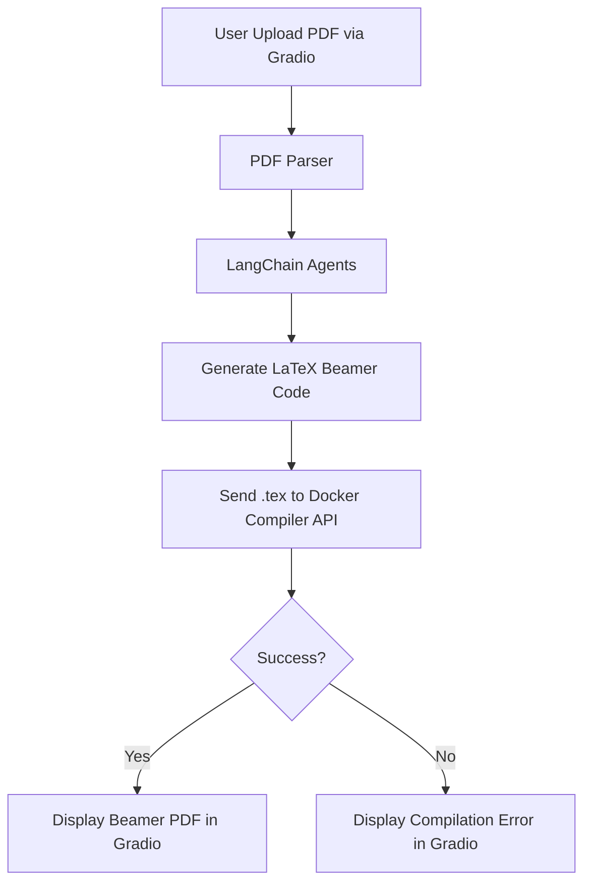
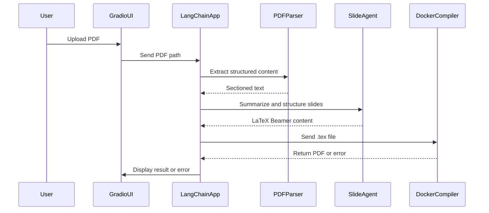

# PaperToPPT

### Project Documentation: Academic Paper to Beamer Slide Generator

---

## Overview

This project automates the transformation of an academic paper (in PDF format) into a presentation-ready Beamer slide PDF. The system is modular, built with a front-end UI in **Gradio**, an agent-based back-end logic using **LangChain**, and a **Docker**-encapsulated LaTeX compiler. The system processes the paper, extracts key sections, summarizes them for oral presentation, and then compiles them into LaTeX Beamer code, which is further compiled into a PDF.

---

## Table of Contents

1. **Introduction**
2. **System Architecture**
3. **Key Modules**
4. **Workflow**
5. **Dependencies and Setup**
6. **API Specifications**
7. **Testing**
8. **Contributions**
9. **License**

---

## 1. Introduction

The purpose of this system is to automate the creation of presentation slides from academic papers in PDF format. It is particularly useful for researchers and students who need to prepare slides for a presentation based on their research paper quickly. The system reads the PDF, extracts and summarizes its content, converts it into a Beamer LaTeX presentation format, and compiles it into a PDF suitable for presentation.

---

## 2. System Architecture

The system is structured in a modular way with the following components:

* **Gradio UI**: A user-friendly interface for uploading PDFs and viewing results.
* **LangChain Agents**: Used for processing and summarizing the paper content.
* **PDF Parsing**: Extracts structured text from the PDF.
* **LaTeX Compilation**: A Docker container runs a LaTeX compiler to generate the final Beamer PDF.



---

## 3. Key Modules

### 3.1. **Gradio UI**

* **Responsibilities**: Handle user inputs (upload PDF), display the generated slides or errors.
* **Key Functions**:

  * `upload_pdf()`: Allows the user to upload the PDF.
  * `display_pdf()`: Displays the final Beamer PDF in the UI.
  * `display_error()`: Shows error messages from the LaTeX compilation process.

### 3.2. **PDF Parser**

* **Responsibilities**: Extract text, images, and structure from the PDF file.
* **Key Functions**:

  * `extract_sections()`: Parses the PDF and divides it into sections (e.g., Introduction, Methods, Results).
  * `detect_figures()`: Extracts images or graphs and stores them for later use.

### 3.3. **LangChain Agents**

* **Responsibilities**: Summarize sections, structure content, and create LaTeX Beamer code.
* **Key Functions**:

  * `process_pdf(file)`: Sends PDF content to LangChain for processing.
  * `generate_latex(slide_data)`: Converts summarized content into LaTeX Beamer format.

### 3.4. **Docker Compiler**

* **Responsibilities**: Run a LaTeX compiler in a Docker container to generate a final PDF.
* **Key Functions**:

  * `compile_tex(tex_file)`: Takes the LaTeX file, compiles it into a PDF.
  * `return_pdf_or_error()`: Returns the PDF or compilation error message.

---

## 4. Workflow

### 4.1. User Flow

1. **Upload PDF**: The user uploads a PDF file via the Gradio UI.
2. **Parse PDF**: The system extracts the content from the uploaded PDF, identifying sections such as Introduction, Methods, Results, etc.
3. **Summarize & Structure**: Using LangChain agents, the extracted text is summarized and converted into bullet points suitable for an oral presentation.
4. **Generate LaTeX Beamer Code**: The system then formats the summary into LaTeX Beamer slides.
5. **Compile LaTeX**: The LaTeX code is sent to a Docker container running a LaTeX compiler (e.g., pdflatex) for PDF generation.
6. **Display Result**: The final PDF is displayed in the Gradio UI, or an error message is shown if the compilation fails.

### 4.2. Example Sequence Diagram



---

## 5. Dependencies and Setup

### 5.1. **Software Requirements**

* Python 3.8 or higher
* Docker (for LaTeX compilation)
* `Gradio` for the front-end UI
* `LangChain` for the back-end agent logic
* `pdfplumber` or `PyMuPDF` for PDF parsing
* LaTeX distribution (e.g., TeX Live) inside Docker container

### 5.2. **Setup Instructions**

1. **Clone the Repository**:

   ```bash
   git clone https://github.com/yourusername/paper-to-beamer.git
   cd paper-to-beamer
   ```

2. **Install Dependencies**:

   ```bash
   pip install -r requirements.txt
   ```

3. **Docker Setup**:
   Ensure Docker is installed and running on your machine. Build the LaTeX Docker image:

   ```bash
   docker build -t latex-compiler .
   ```

4. **Run the Application**:

   ```bash
   python app.py
   ```

---

## 6. API Specifications

### 6.1. **Upload PDF**:

* **Endpoint**: `/upload`
* **Method**: `POST`
* **Parameters**:

  * `file`: PDF file (multipart/form-data)
* **Response**:

  * `success`: Boolean indicating success or failure
  * `message`: Description of the result or error

### 6.2. **Generate Beamer**:

* **Endpoint**: `/generate`
* **Method**: `POST`
* **Parameters**:

  * `file_path`: Path to the uploaded PDF
* **Response**:

  * `latex_code`: LaTeX Beamer code (if successful)
  * `error`: Compilation error (if any)

---

## 7. Testing

### 7.1. **Unit Tests**

* Test PDF parsing, summarization, LaTeX code generation, and Docker compilation.
* Mock external services like the LaTeX compiler for local testing.

### 7.2. **Integration Tests**

* Test the complete flow from uploading a PDF to displaying the generated slides.

---

## 8. Contributions

We welcome contributions! Please fork this repository, make changes, and submit a pull request with a description of your improvements.

---

## 9. License

This project is licensed under the MIT License - see the [LICENSE](LICENSE) file for details.

---

Feel free to ask if you'd like more details or a deeper dive into any part of the documentation!
