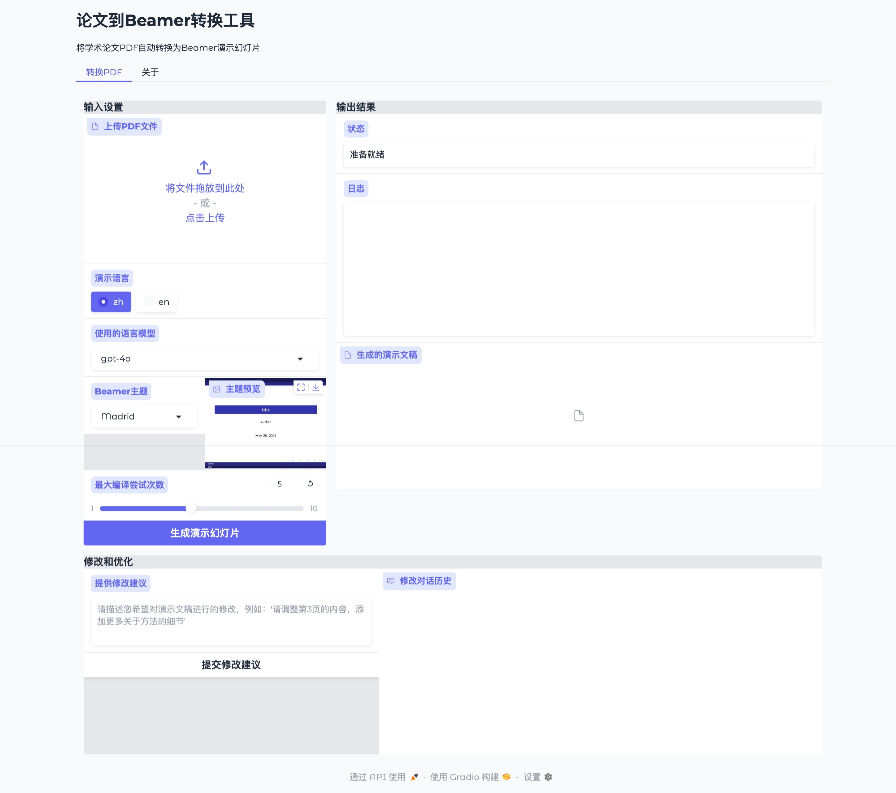

# Paper-to-Beamer

将学术论文PDF自动转换为Beamer演示幻灯片的工具

[English Version](./docs/README_EN.md)



## 项目介绍

Paper-to-beamer是一个基于人工智能的工具，可以将学术论文PDF自动转换为Beamer演示幻灯片。它使用大型语言模型分析论文内容，提取关键信息，并生成结构良好的演示文稿。该工具支持多轮对话修改，让用户能够通过自然语言反馈不断优化生成的幻灯片。

### 主要功能

- **PDF内容提取**：自动从PDF中提取文本、图像和结构信息（基于maker-pdf深度学习模型）。
- **智能内容分析**：识别论文的标题、作者、摘要、章节结构和关键图表。
- **演示计划生成**：根据论文内容生成结构化的演示计划。
- **Beamer代码生成**：生成完整的LaTeX Beamer代码。
- **多轮对话修改**：支持通过自然语言反馈修改生成的幻灯片。
- **多种主题持**：支持多种Beamer主题。
- **中英文支持**：支持生成中文和英文演示文稿。
- **成本与用量监控 (新)**：集成了LangSmith，可以方便地追踪和监控对LLM API的调用次数、token消耗和相关费用。
- **代码语法高亮 (新)**：支持在幻灯片中展示带语法高亮的代码片段（使用`minted`宏包）。
- **图片自动缩放 (改进)**：自动调整插入幻灯片的图片尺寸，防止图片因过大而超出边界。

## 安装指南

### 环境要求

- Python 3.8+
- LaTeX环境（推荐TeX Live或MiKTeX）。
- **重要**：由于使用了`minted`宏包进行代码高亮，LaTeX编译器需要启用`-shell-escape`选项。
- OpenAI API密钥。

### 安装步骤

1.  **克隆仓库**

    ```bash
    git clone https://github.com/wzsyyh/paper-to-beamer.git
    cd paper-to-beamer
    ```

2.  **创建虚拟环境（推荐）**

    ```bash
    python -m venv venv
    source venv/bin/activate  # Linux/Mac
    # 或
    venv\Scripts\activate  # Windows
    ```

3.  **安装依赖**

    ```bash
    pip install -r requirements.txt
    ```

4.  **下载maker-pdf模型（首次使用前须完成！）**

    ```bash
    pip install modelscope
    python down_model.py
    ```
    > `down_model.py`内容如下：
    > ```python
    > from modelscope import snapshot_download
    > snapshot_download('Lixiang/marker-pdf', local_dir='models')
    > ```

5.  **设置 API 密钥与 LangSmith (重要)**

    创建`.env`文件，并添加以下内容。

    ```dotenv
    # OpenAI API 配置
    OPENAI_API_KEY=your_openai_api_key_here

    # LangSmith 配置 (可选，但强烈推荐)
    # 用于追踪和监控 token 使用情况和成本
    LANGCHAIN_TRACING_V2="true"
    LANGCHAIN_ENDPOINT="https://api.smith.langchain.com"
    LANGCHAIN_API_KEY="your_langsmith_api_key_here"
    LANGCHAIN_PROJECT="paper-to-beamer" # 可选，为你的项目命名
    ```

    > **安全警告**：切勿将包含真实API密钥的`.env`或`env.local`文件提交到公共仓库！这些文件已在`.gitignore`中设置为忽略。

## 使用方法

### Web界面

1.  **启动Web服务器**

    ```bash
    python app.py
    ```

2.  在浏览器中打开 http://localhost:7860

3.  上传PDF文件，选择语言和主题，点击"生成演示幻灯片"按钮。

4.  等待处理完成，下载生成的PDF文件。

5.  如需修改，在"提供修改建议"输入框中输入您的反馈并提交。

### 命令

基本用法：

```bash
python main.py path/to/your/paper.pdf
```

高级选项：

```bash
python main.py path/to/your/paper.pdf --language zh --model gpt-4o --theme Madrid --output-dir output
```

## 常见问题

- **图片未能正确提取/不到图片？**
  - 请确认已下载maker-pdf模型，并确保 `output/images/会话号/` 下有图片文件。
- **API密钥未配置？**
  - 请在 `.env` 文件中填写 `OPENAI_API_KEY`。
- **编译失败，错误信息提示 `minted Error: You must invoke LaTeX with the -shell-escape flag.`**
  - 这是因为项目中使用了 `minted` 宏包来提供代码语法高亮，它需要执行外部程序。项目的编译脚本已自动添加 `-shell-escape` 标志。如果你是手动编译生成的 `.tex` 文件，请确保在 `pdflatex` 或 `xelatex` 命令中也加入此标志，例如：`pdflatex -shell-escape your_file.tex`。

## 二次开发

如果您想进行二次开发，请参考[代码库文档](./CODEBASE.md)。

## 许可证

本项目采用MIT许可证。二次开发时需要提及本仓库。用于商业用途的二次开发需要联系原作者获得授权。

## 联系方式

如有问题或建议，请通过以下方式联系：

- 提交GitHub Issue
- 发送邮件至：yangyuheng@westlake.edu.cn

## 项目结构

```
paper-to-beamer/
├── main.py                  # 命令行主入口文件
├── app.py                   # Web界面入口文件
├── patch_openai.py          # OpenAI API兼容性补丁
├── modules/                 # 模块目录
│   ├── pdf_parser.py        # PDF解析模块
│   ├── content_processor.py # 内容处理模块
│   ├── presentation_planner.py # 演示计划模块
│   ├── tex_generator.py     # TEX生成模块
│   ├── tex_validator.py     # TEX验证模块
│   └── tex_workflow.py      # TEX工作流模块
├── tests/                   # 测试模块
├── utils/                   # 工具函数
├── output/                  # 输出文件目录
│   ├── raw/                 # 原始解析数据
│   ├── plan/                # 演示计划数据
│   └── tex/                 # 生成的TEX文件
├── static/                  # 静态源目录
│   └── themes/              # Beamer主题预览图片
├── tools/                   # 工具脚本
├── examples/                # 示例论文
└── docs/                    # 文档
