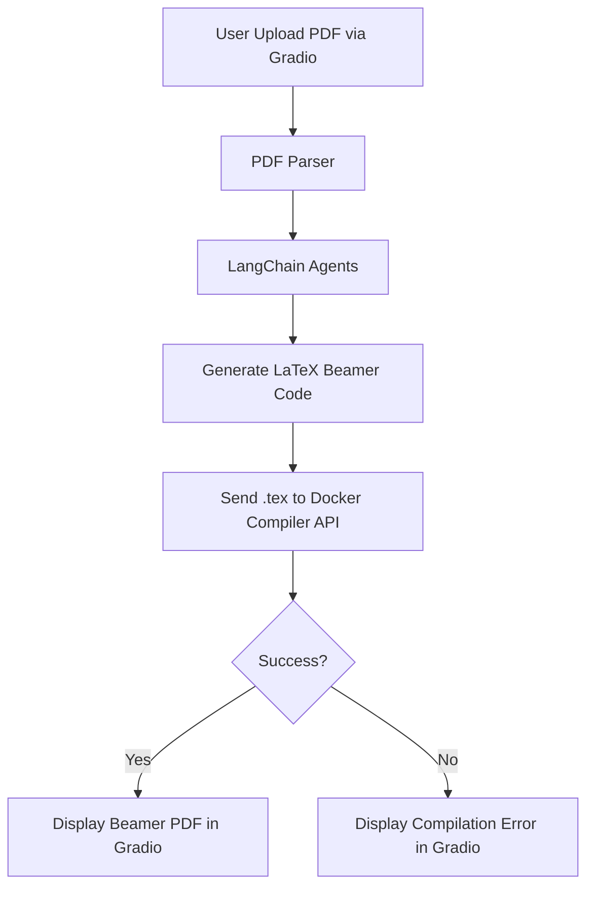
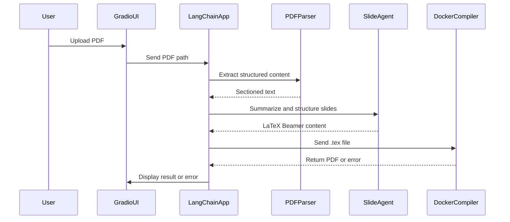

### 项目文档：学术论文转 Beamer 幻灯片生成器

---

## 概述

本项目旨在将学术论文（PDF 格式）自动转换为适合演讲的 Beamer 幻灯片 PDF。系统采用模块化设计，前端使用 **Gradio**，后端采用 **LangChain** 进行代理逻辑处理，PDF 解析和 LaTeX 编译则通过 **Docker** 封装。系统可以处理论文内容，提取关键信息，进行总结和转化为 LaTeX Beamer 代码，最终生成适合演讲的 PDF 幻灯片。

---

## 目录

1. **简介**
2. **系统架构**
3. **关键模块**
4. **工作流程**
5. **依赖与安装**
6. **API 规范**
7. **测试**
8. **贡献**
9. **许可证**

---

## 1. 简介

本系统的目标是自动将学术论文（PDF 格式）转化为演示幻灯片，尤其适用于研究人员和学生需要快速准备学术汇报时。系统读取 PDF 文件，提取并总结内容，转换为 Beamer LaTeX 格式的幻灯片代码，然后使用 LaTeX 编译器生成 PDF 文件，以便进行展示。

---

## 2. 系统架构

该系统结构模块化，包含以下组件：

* **Gradio UI**：一个用户友好的界面，用于上传 PDF 文件和查看结果。
* **LangChain 代理**：用于处理和总结论文内容。
* **PDF 解析**：提取 PDF 文件中的结构化文本。
* **LaTeX 编译**：通过 Docker 容器运行 LaTeX 编译器生成最终的 Beamer PDF。



---

## 3. 关键模块

### 3.1. **Gradio UI**

* **职责**：处理用户输入（上传 PDF 文件）、展示生成的幻灯片或错误信息。
* **关键函数**：

  * `upload_pdf()`: 允许用户上传 PDF 文件。
  * `display_pdf()`: 在界面上展示最终生成的 Beamer PDF。
  * `display_error()`: 显示 LaTeX 编译错误信息。

### 3.2. **PDF 解析**

* **职责**：从 PDF 文件中提取文本、图片和结构。
* **关键函数**：

  * `extract_sections()`: 解析 PDF，将其分为各个章节（例如：引言、方法、结果等）。
  * `detect_figures()`: 提取图片或图表，并存储供后续使用。

### 3.3. **LangChain 代理**

* **职责**：总结章节内容、构建幻灯片，并生成 LaTeX Beamer 代码。
* **关键函数**：

  * `process_pdf(file)`: 将 PDF 内容发送给 LangChain 进行处理。
  * `generate_latex(slide_data)`: 将总结后的内容转换为 LaTeX Beamer 格式。

### 3.4. **Docker 编译器**

* **职责**：在 Docker 容器中运行 LaTeX 编译器，生成最终的 PDF。
* **关键函数**：

  * `compile_tex(tex_file)`: 接收 LaTeX 文件并编译成 PDF。
  * `return_pdf_or_error()`: 返回生成的 PDF 或编译错误信息。

---

## 4. 工作流程

### 4.1. 用户流程

1. **上传 PDF 文件**：用户通过 Gradio UI 上传 PDF 文件。
2. **解析 PDF**：系统从上传的 PDF 中提取内容，识别章节，如引言、方法、结果等。
3. **总结与结构化**：使用 LangChain 代理对提取的文本进行总结，生成适合演讲的口语化摘要，并转换为 LaTeX 幻灯片代码。
4. **生成 LaTeX Beamer 代码**：系统将总结后的内容转换为 LaTeX Beamer 代码。
5. **编译 LaTeX**：LaTeX 代码被发送到 Docker 容器中的编译器进行 PDF 生成。
6. **展示结果**：生成的 PDF 被展示在 Gradio UI 中，或显示编译错误信息。

### 4.2. 示例序列图



---

## 5. 依赖与安装

### 5.1. **软件要求**

* Python 3.8 或更高版本
* Docker（用于 LaTeX 编译）
* `Gradio`（用于前端界面）
* `LangChain`（用于后端代理逻辑）
* `pdfplumber` 或 `PyMuPDF`（用于 PDF 解析）
* LaTeX 发行版（例如：TeX Live）在 Docker 容器内运行

### 5.2. **安装步骤**

1. **克隆仓库**：

   ```bash
   git clone https://github.com/yourusername/paper-to-beamer.git
   cd paper-to-beamer
   ```

2. **安装依赖**：

   ```bash
   pip install -r requirements.txt
   ```

3. **Docker 设置**：
   确保已安装 Docker，并确保 Docker 正在运行。构建 LaTeX Docker 镜像：

   ```bash
   docker build -t latex-compiler .
   ```

4. **运行应用**：

   ```bash
   python app.py
   ```

---

## 6. API 规范

### 6.1. **上传 PDF**：

* **接口**: `/upload`
* **方法**: `POST`
* **参数**:

  * `file`: PDF 文件（multipart/form-data）
* **响应**:

  * `success`: 布尔值，表示操作是否成功
  * `message`: 结果或错误的描述信息

### 6.2. **生成 Beamer 幻灯片**：

* **接口**: `/generate`
* **方法**: `POST`
* **参数**:

  * `file_path`: 上传的 PDF 文件路径
* **响应**:

  * `latex_code`: 生成的 LaTeX Beamer 代码（成功时）
  * `error`: 编译错误信息（失败时）

---

## 7. 测试

### 7.1. **单元测试**

* 测试 PDF 解析、摘要生成、LaTeX 代码生成和 Docker 编译过程。
* 使用 Mock 对外部服务进行本地测试。

### 7.2. **集成测试**

* 测试从上传 PDF 到展示生成幻灯片的完整流程。

---

## 8. 贡献

欢迎贡献！请先 Fork 该仓库，进行修改并提交 Pull Request，附上改进描述。

---

## 9. 许可证

本项目使用 MIT 许可证 - 请查看 [LICENSE](LICENSE) 文件获取详细信息。

---

如果你有任何问题或需要进一步的帮助，请随时告知！
