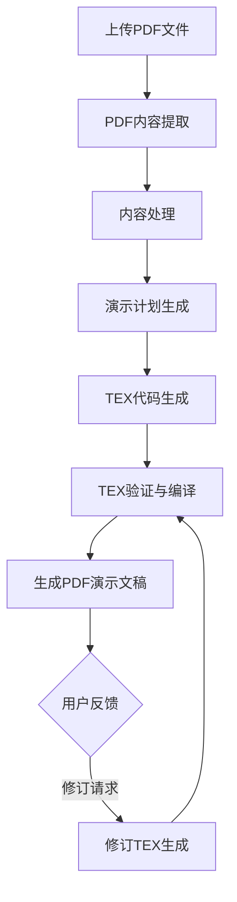

# Paper-to-Beamer 项目实现逻辑

Paper-to-Beamer 是一个基于人工智能的工具，可以将学术论文 PDF 自动转换为 Beamer 演示幻灯片。下面将详细讲解项目的实现逻辑和工作流程。

## 整体架构

项目采用模块化设计，主要包括以下核心组件：

1. **PDF 解析模块**：负责从 PDF 中提取文本、图像和结构信息
2. **内容处理模块**：对提取的内容进行结构化处理
3. **演示计划生成模块**：使用大语言模型分析内容，生成演示计划
4. **TEX 生成模块**：将演示计划转换为 Beamer TEX 代码
5. **TEX 验证模块**：验证和编译 TEX 代码，生成最终的 PDF 演示文稿
6. **修订模块**：支持基于用户反馈的多轮修订

项目有两个主要入口：
- `main.py`：命令行入口
- `app.py`：Web 界面入口（基于 Gradio）

## 工作流程

整个工作流程可以分为以下几个主要步骤：

### 1. PDF 内容提取

**核心模块**：`raw_extractor.py` 和 `pdf_parser.py`

这一步骤负责从 PDF 文件中提取原始内容，包括：
- 文本内容（使用 PyMuPDF 和 pdfplumber）
- 图像内容（使用 maker-pdf 深度学习模型）
- 文档结构信息（如目录、页面布局等）

提取的内容保存在 `output/raw/<session_id>/` 目录下，图像保存在 `output/images/<session_id>/` 目录下。

关键实现：
- 使用 `marker-pdf` 深度学习模型提取图像
- 对提取的图像进行筛选和分组，识别重要图表
- 提取文本时保留格式信息，便于后续结构化处理

### 2. 内容处理

**核心模块**：`content_processor.py`

这一步骤对提取的原始内容进行结构化处理，包括：
- 识别论文的标题、作者、摘要等基本信息
- 分析论文的章节结构
- 识别关键图表及其描述

处理后的内容仍保存在 `output/raw/<session_id>/` 目录下。

### 3. 演示计划生成

**核心模块**：`presentation_planner.py`

这是项目的核心步骤，使用大语言模型（如 GPT-4o）分析论文内容，生成结构化的演示计划：
- 提取论文的主要贡献点
- 识别方法论和关键结果
- 规划幻灯片结构（标题页、目录、引言、方法、结果、结论等）
- 为每张幻灯片规划内容要点
- 选择合适的图表并关联到相应的幻灯片

生成的演示计划以 JSON 格式保存在 `output/plan/<session_id>/` 目录下。

关键实现：
- 使用 LangChain 框架与 OpenAI API 交互
- 精心设计的 Prompt 引导模型生成高质量的演示计划
- 支持多轮对话优化演示计划

### 4. TEX 代码生成

**核心模块**：`tex_generator.py`

这一步骤将演示计划转换为完整的 Beamer TEX 代码：
- 生成文档前导部分（包括包引入、主题设置等）
- 为每张幻灯片创建帧结构
- 处理图像引用，确保路径正确
- 根据语言设置添加适当的语言支持（如中文使用 ctex）

生成的 TEX 代码保存在 `output/tex/<session_id>/` 目录下。

### 5. TEX 验证与编译

**核心模块**：`tex_validator.py` 和 `tex_workflow.py`

这一步骤验证生成的 TEX 代码并编译为 PDF：
- 检查 TEX 代码的语法正确性
- 处理图像引用，确保图像文件存在
- 使用 pdflatex 或 xelatex（中文）编译 TEX 代码
- 如果编译失败，使用大语言模型分析错误并修复代码
- 支持多次重试编译

编译生成的 PDF 文件保存在 `output/tex/<session_id>/` 目录下。

### 6. 修订功能

**核心模块**：`revision_tex_generator.py`

项目支持基于用户反馈的多轮修订：
- 用户提供自然语言反馈
- 系统分析反馈并修改 TEX 代码
- 重新编译生成修订版 PDF

修订版文件保存在 `output/tex/<session_id>/revision_<timestamp>/` 目录下。

## 关键技术点

1. **图像处理**：
   - 使用 maker-pdf 深度学习模型提取图像
   - 所有图像统一保存在 `output/images/<session_id>/` 目录下
   - 图像路径规范化，确保在整个流程中一致引用

2. **大语言模型应用**：
   - 使用 GPT-4o 等模型分析论文内容
   - 精心设计的 Prompt 引导模型生成高质量输出
   - 多轮对话优化和修订功能

3. **TEX 编译**：
   - 支持中英文文档编译
   - 自动修复编译错误
   - 多次重试机制

4. **会话管理**：
   - 使用会话 ID 隔离不同的处理任务
   - 保存处理过程中的中间结果，便于调试和修订

## 扩展性设计

项目具有良好的扩展性：
- 模块化设计，各组件可独立升级
- 支持多种 Beamer 主题
- 支持中英文演示文稿
- 可通过修改 Prompt 优化输出质量
- 可集成新的图像提取模型

## 模块详细说明

### PDF 解析模块

`pdf_parser.py` 是一个简单的封装，它调用 `raw_extractor.py` 的功能来提取 PDF 内容。

`raw_extractor.py` 是实际执行 PDF 解析的模块，它使用 PyMuPDF 和 pdfplumber 提取文本内容，使用 maker-pdf 深度学习模型提取图像。它还负责提取文档结构信息，如目录、页面布局等。

关键类和方法：
- `RawExtractor` 类：负责从 PDF 文件中提取原始内容
- `extract_raw_content` 函数：便捷函数，用于从 PDF 文件中提取原始内容

### 内容处理模块

`content_processor.py` 对提取的原始内容进行结构化处理，识别论文的标题、作者、摘要等基本信息，分析论文的章节结构，识别关键图表及其描述。

### 演示计划生成模块

`presentation_planner.py` 是项目的核心模块，它使用大语言模型分析论文内容，生成结构化的演示计划。

关键类和方法：
- `PresentationPlanner` 类：负责生成演示计划
- `generate_presentation_plan` 函数：便捷函数，用于从原始内容生成演示计划

主要功能：
- `_extract_paper_info`：提取论文基本信息
- `_extract_key_content`：提取论文关键内容
- `_plan_slides`：规划幻灯片结构和内容
- `interactive_refinement`：支持多轮对话优化演示计划
- `continue_conversation`：继续与用户的对话，更新演示计划

### TEX 生成模块

`tex_generator.py` 将演示计划转换为完整的 Beamer TEX 代码。

关键类和方法：
- `TexGenerator` 类：负责生成 TEX 代码
- `generate_tex` 函数：便捷函数，用于从演示计划生成 TEX 代码

### TEX 验证模块

`tex_validator.py` 验证生成的 TEX 代码并编译为 PDF。

关键类和方法：
- `TexValidator` 类：负责验证和编译 TEX 代码
- `validate_tex` 函数：便捷函数，用于验证 TEX 文件能否成功编译

主要功能：
- `validate`：验证 TEX 文件能否成功编译
- `fix_tex_code`：使用语言模型修复 TEX 代码

### TEX 工作流模块

`tex_workflow.py` 协调整个 TEX 生成和编译流程。

关键类和方法：
- `TexWorkflow` 类：负责执行 TEX 工作流
- `run_tex_workflow` 函数：便捷函数，用于运行 TEX 工作流
- `run_revision_tex_workflow` 函数：便捷函数，用于运行修订版 TEX 工作流

### 修订模块

`revision_tex_generator.py` 支持基于用户反馈的多轮修订。

关键类和方法：
- `RevisionTexGenerator` 类：负责生成修订版 TEX 代码
- `generate_revised_tex` 函数：便捷函数，用于生成修订版 TEX 代码

## 总结

Paper-to-Beamer 项目通过结合 PDF 解析技术、深度学习模型和大语言模型，实现了从学术论文到演示幻灯片的自动转换，并支持多轮对话修改，大大提高了学术演示文稿的制作效率。项目采用模块化设计，具有良好的扩展性，可以根据需要进行定制和优化。
